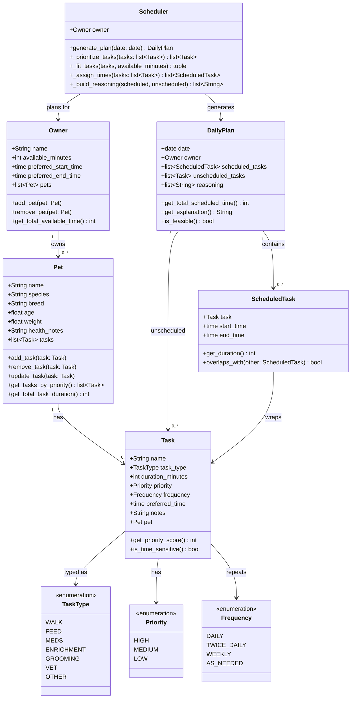

```mermaid
classDiagram
    class Owner {
        +String name
        +int available_minutes
        +time preferred_start_time
        +time preferred_end_time
        +list~Pet~ pets
        +add_pet(pet: Pet)
        +remove_pet(pet: Pet)
        +get_total_available_time() int
    }

    class Pet {
        +String name
        +String species
        +String breed
        +float age
        +float weight
        +String health_notes
        +list~Task~ tasks
        +add_task(task: Task)
        +remove_task(task: Task)
        +update_task(task: Task)
        +get_tasks_by_priority() list~Task~
        +get_total_task_duration() int
    }

    class Task {
        +String name
        +TaskType task_type
        +int duration_minutes
        +Priority priority
        +Frequency frequency
        +time preferred_time
        +String notes
        +Pet pet
        +get_priority_score() int
        +is_time_sensitive() bool
    }

    class ScheduledTask {
        +Task task
        +time start_time
        +time end_time
        +get_duration() int
        +overlaps_with(other: ScheduledTask) bool
    }

    class DailyPlan {
        +date date
        +Owner owner
        +list~ScheduledTask~ scheduled_tasks
        +list~Task~ unscheduled_tasks
        +list~String~ reasoning
        +get_total_scheduled_time() int
        +get_explanation() String
        +is_feasible() bool
    }

    class Scheduler {
        +Owner owner
        +generate_plan(date: date) DailyPlan
        +_prioritize_tasks(tasks: list~Task~) list~Task~
        +_fit_tasks(tasks, available_minutes) tuple
        +_assign_times(tasks: list~Task~) list~ScheduledTask~
        +_build_reasoning(scheduled, unscheduled) list~String~
    }

    class TaskType {
        <<enumeration>>
        WALK
        FEED
        MEDS
        ENRICHMENT
        GROOMING
        VET
        OTHER
    }

    class Priority {
        <<enumeration>>
        HIGH
        MEDIUM
        LOW
    }

    class Frequency {
        <<enumeration>>
        DAILY
        TWICE_DAILY
        WEEKLY
        AS_NEEDED
    }

    Owner "1" --> "0..*" Pet : owns
    Pet "1" --> "0..*" Task : has
    Task --> TaskType : typed as
    Task --> Priority : has
    Task --> Frequency : repeats
    Scheduler --> Owner : plans for
    Scheduler --> DailyPlan : generates
    DailyPlan "1" --> "0..*" ScheduledTask : contains
    DailyPlan "1" --> "0..*" Task : unscheduled
    ScheduledTask --> Task : wraps
```
